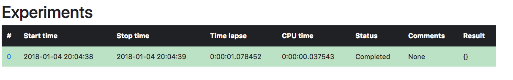
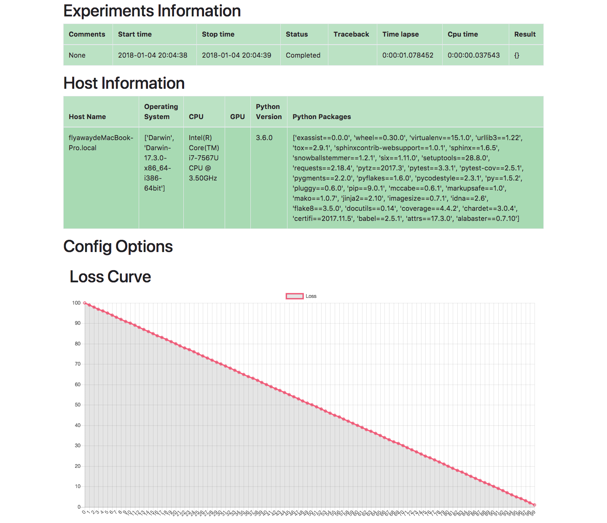

Quickstart
**********

Installation
============
You can get ExAssist directly from pypi like this:

.. code-block:: console

    pip install ExAssist

Also, you can clone the git repo and install it from source file:

.. code-block:: console

    git clone
    cd ExAssist
    python setup.py install

Hello World
============
Let's directly jump into it. Here is a miniml experiment using ExAssist:

.. code-block:: python

    import ExAssist as EA

    # Get an instance of ExAssist just like getting a logger.
    assist = EA.getAssist('Test')

    with EA.start(assist) as assist:
        # Here starts your experiments.
        for i in range(100):
            assist.info['loss'] = 100 - i
            assist.step()

We did following things here:
    - import ``ExAssist``
    - get a ExAssist instance just like `logging <https://docs.python.org/3.6/library/logging.html#logging.getLogger>`_ library.
    - create a experiment context
    - run your own experiments within this context

    .. NOTE::
        Different from the logginer,  ExAssist does not have hierarchy structure. So, ``ExAssist.get('a.b')`` is useless.

Once you run this simple script, ExAssist will create a directory called ``Experiments``, which contains all the information of current experiment.
Enter the Experiments directory, run the following code::

    python -m http.server 8080

Now, open your browser and open page at `http://localhost:8080/ <http://localhost:8080/>`_.
You will see an index page like:

This table shows basic infomation of your experiments.
Click on the number of experiment,  you will see more detialed information of this experiment:

